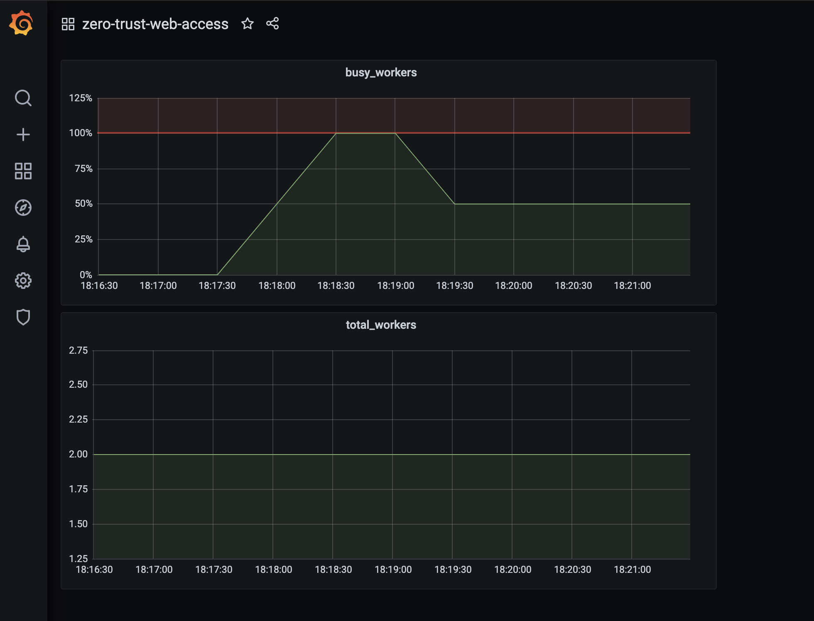

# Akeyless Monitoring

## Introduction
This chart expose metrics for monitoring purpose by using standard tools such as Prometheus, and Grafana.

## Prerequisites
- Helm 3+
- Prometheus

### Prometheus Installation
Follow the [instructions](https://github.com/prometheus-community/helm-charts/tree/main/charts/kube-prometheus-stack#prometheusioscrape) and install Prometheus on your cluster.

#### TL;DR
Get Repo Info
```console
helm repo add prometheus-community https://prometheus-community.github.io/helm-charts
helm repo update
```

Install Chart
```console
# Helm
$ helm install [RELEASE_NAME] prometheus-community/kube-prometheus-stack -n [NAMESPACE]
```

### prometheus.io/scrape
There are two ways to scrap data:
- **Pod Annotation-based Discovery** - make sure your prometheus contains pod annotation `job` in the config map, for example:
```yaml
- job_name: 'kubernetes-pods'

        kubernetes_sd_configs:
        - role: pod

        relabel_configs:
        - source_labels: [__meta_kubernetes_pod_annotation_prometheus_io_scrape]
          action: keep
          regex: true
        - source_labels: [__meta_kubernetes_pod_annotation_prometheus_io_path]
          action: replace
          target_label: __metrics_path__
          regex: (.+)
        - source_labels: [__address__, __meta_kubernetes_pod_annotation_prometheus_io_port]
          action: replace
          regex: ([^:]+)(?::\d+)?;(\d+)
          replacement: $1:$2
          target_label: __address__
        - action: labelmap
          regex: __meta_kubernetes_pod_label_(.+)
        - source_labels: [__meta_kubernetes_namespace]
          action: replace
          target_label: kubernetes_namespace
        - source_labels: [__meta_kubernetes_pod_name]
          action: replace
          target_label: kubernetes_pod_name
```
When supporting Pod Annotation, `ServiceMonitor` can be disabled.

- **ServiceMonitor** is the more recommended way to scrap data. Prometheus discovers only once that are labeled with the same release tag as the prometheus-operator release name.
  So under this chart `values.yaml` file, set the Prometheus release name label in `metrics.serviceMonitor.releaseLabels` with the operator release name (RELEASE_NAME), for example:  
 ```yaml
  releaseLabels:
    release: kube-prometheus    
```
For more information please read the following [guide](https://github.com/prometheus-community/helm-charts/tree/main/charts/kube-prometheus-stack#prometheusioscrape)


### Grafana Dashboard
We expose the metrics also in Grafana dashboard for visualization and alerts purpose.

#### General
When installing Prometheus, it contains some default and important dashboards which expose metrics about resource utilization, Latency, 
Pods Status, Network, etc. If its not exists on your cluster, here are some examples you can import from the Grafana marketplace:
- [Kubernetes / Compute Resources / Pod](https://grafana.com/grafana/dashboards/12117) - Resource information such as Memory and CPU utilization. 
- [Kubernetes / Networking / Namespace (Pods)](https://grafana.com/grafana/dashboards/12125) - Networking information by Pods.


#### Akeyless-Zero-Trust-Web-Access
On this service, we expose metrics such as number of `web-workers`, how many are in busy state, etc. 
Please import the file `akeyless-zero-trust-web-access/grafana-dashbord.yaml` to your Grafana, the outcome for example:

 
